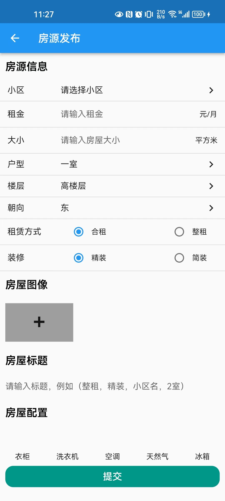

# rent_house

租房项目

## Getting Started

>  flutter --version    

Flutter 3.7.8 • channel stable • https://github.com/flutter/flutter.git

Framework • revision 90c64ed42b (4 months ago) • 2023-03-21 11:27:08 -0500

Engine • revision 9aa7816315

Tools • Dart 2.19.5 • DevTools 2.20.1

## 效果

- 主页

- 搜索页

- 咨询页

- 个人中心

- 房屋详情

- 发布房源

- 个人房源
